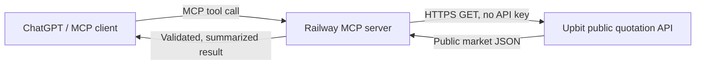

# Upbit Market Analyzer

업비트 **공개 시세 데이터만 조회**하는 읽기 전용 MCP 서버입니다. ChatGPT/Codex 같은 MCP 클라이언트가 원화 마켓의 현재가, 캔들, 호가와 단순 기술 요약을 조회할 수 있습니다.

> 이 프로젝트는 주문, 잔액, 입출금, 계정 조회를 구현하지 않으며 업비트 Access Key/Secret Key를 요구하지 않습니다. 결과는 투자 조언이나 수익 보장이 아닙니다.

## 제공 도구

| MCP 도구 | 기능 |
|---|---|
| `list_krw_markets` | KRW 마켓 목록 |
| `get_ticker` | 현재가·변동률·거래대금 |
| `get_orderbook` | 최우선 호가와 호가 잔량 |
| `get_candles` | 분/일봉 OHLCV |
| `analyze_market` | 이동평균·RSI·변동성·거래량 기반의 객관적 요약 |

## 요청 흐름



MCP 엔드포인트는 배포 주소의 `/mcp`입니다. 서버 자체는 거래소 계정에 로그인하지 않습니다.

## 인증과 비밀정보

- 업비트 개인 API 키: 사용하지 않음
- JWT/주문 서명: 생성하지 않음
- 주문·잔액·입출금 API: 코드에서 차단
- GitHub/Railway 토큰: 각 서비스의 연결 계층에서 관리하며 저장소에 저장하지 않음
- 로그: 환경변수 값, 인증 헤더 또는 비밀정보를 기록하지 않음

자세한 내용은 [SECURITY.md](SECURITY.md)와 [docs/AUTHENTICATION.md](docs/AUTHENTICATION.md)를 참고하세요.

## 로컬 실행

Python 3.11 이상이 필요합니다.

```bash
python -m venv .venv
source .venv/bin/activate
pip install -r requirements.txt
python server.py
```

MCP 클라이언트에서 `http://localhost:8000/mcp`에 연결합니다.

## Railway 배포

1. Railway에서 이 GitHub 저장소를 선택합니다.
2. 별도의 업비트 키는 등록하지 않습니다.
3. Railway가 `railway.json`의 시작 명령을 사용합니다.
4. 생성된 공개 도메인의 끝에 `/mcp`를 붙여 ChatGPT MCP 연결 주소로 사용합니다.

Railway가 제공하는 `PORT` 환경변수는 시작 명령에서 자동 사용됩니다.

## 안전 경계

`upbit_client.py`는 허용된 공개 호스트와 `/v1/market/all`, `/v1/ticker`, `/v1/orderbook`, `/v1/candles/*` 경로만 호출합니다. 사용자 입력을 URL로 직접 사용하지 않습니다.

## 공식 참고 문서

- [Upbit API Reference](https://global-docs.upbit.com/reference)
- [MCP Python SDK](https://github.com/modelcontextprotocol/python-sdk)
