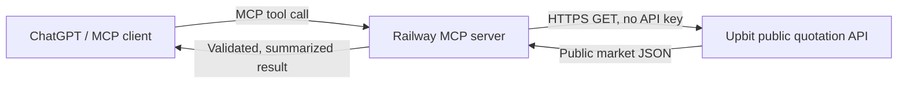

# Upbit Market Analyzer

업비트 **공개 시세 데이터만 조회**하는 읽기 전용 MCP 서버입니다. ChatGPT/Codex 같은 MCP 클라이언트가 원화 마켓의 현재가, 캔들, 호가와 단순 기술 요약을 조회할 수 있습니다.

> 이 프로젝트는 주문, 잔액, 입출금, 계정 조회를 구현하지 않으며 업비트 Access Key/Secret Key를 요구하지 않습니다. 결과는 투자 조언이나 수익 보장이 아닙니다.

## 제공 도구

| MCP 도구 | 기능 |
|---|---|
| `list_krw_markets` | KRW 마켓 목록 |
| `get_ticker` | 현재가·변동률·거래대금 |
| `get_orderbook` | 최우선 호가와 호가 잔량 |
| `get_candles` | 분/일봉 OHLCV |
| `analyze_market` | 이동평균·RSI·변동성·거래량 기반의 객관적 요약 |
| `get_monitor_status` | WebSocket 연결·수신·재접속 상태 |
| `get_recent_alerts` | 최근 탐지 신호 목록 |

## 실시간 감시

`ENABLE_MARKET_MONITOR=true`이면 서버 시작과 함께 업비트 공개 WebSocket
`wss://api.upbit.com/websocket/v1`의 체결 스트림을 계속 수신합니다. 기본값은 모든
KRW 마켓이며 다음 조건을 탐지합니다.

- 1분 가격과 거래대금 동시 급증
- 직전 5분 고점을 거래대금 증가와 함께 돌파
- 거래대금을 동반한 1분 급락 위험

연결이 끊기면 1~60초 지수 백오프로 자동 재연결합니다. 같은 종목·같은 신호는
기본 10분 동안 다시 알리지 않으며, 전체 알림은 분당 5건으로 제한합니다.

Telegram을 사용하려면 `TELEGRAM_BOT_TOKEN`과 `TELEGRAM_CHAT_ID`를 Railway
환경변수에만 등록합니다. 두 값이 없을 때도 탐지는 계속되며 Railway 로그와
`get_recent_alerts`에서 확인할 수 있습니다. 이 감시기는 자동 주문을 하지 않습니다.

### 조건부 진입 후보 분석

`ENABLE_CANDIDATE_ANALYSIS=true`이면 상승 알림 발생 30초 후 해당 종목의 공개
현재가·호가·1분봉·5분봉을 다시 조회합니다. 일간 과열, RSI 과열, 매도호가 우세,
돌파 실패, 신호가 대비 추격 구간을 제외하고 기본 80점 이상인 경우에만 Telegram에
별도의 `[조건부 진입 후보]` 메시지를 보냅니다. 메시지에는 진입구간, 추격금지선,
손절가, 1·2차 목표가, 추천 비중과 5분 유효시간이 포함됩니다.

가격은 현재 공개 호가 간격에서 호가 단위를 추론해 표시합니다. 분석은 공개 데이터의
규칙 기반 선별이며 자동 주문, 개인 계좌 접근, 수익 보장을 하지 않습니다. 같은 종목은
기본 15분 동안 다시 후보 분석하지 않고, 최근 10분 이내 급락 신호가 있었던 종목은
후보에서 제외합니다.

## 요청 흐름



MCP 엔드포인트는 배포 주소의 `/mcp`입니다. 서버 자체는 거래소 계정에 로그인하지 않습니다.

## 인증과 비밀정보

- 업비트 개인 API 키: 사용하지 않음
- JWT/주문 서명: 생성하지 않음
- 주문·잔액·입출금 API: 코드에서 차단
- GitHub/Railway 토큰: 각 서비스의 연결 계층에서 관리하며 저장소에 저장하지 않음
- 로그: 환경변수 값, 인증 헤더 또는 비밀정보를 기록하지 않음
- Telegram Bot Token: 선택 사항이며 Railway 환경변수에서만 읽음

자세한 내용은 [SECURITY.md](SECURITY.md)와 [docs/AUTHENTICATION.md](docs/AUTHENTICATION.md)를 참고하세요.

## 로컬 실행

Python 3.11 이상이 필요합니다.

```bash
python -m venv .venv
source .venv/bin/activate
pip install -r requirements.txt
python server.py
```

MCP 클라이언트에서 `http://localhost:8000/mcp`에 연결합니다.

## Railway 배포

1. Railway에서 이 GitHub 저장소를 선택합니다.
2. 별도의 업비트 키는 등록하지 않습니다.
3. Railway가 `railway.json`의 시작 명령을 사용합니다.
4. 생성된 공개 도메인의 끝에 `/mcp`를 붙여 ChatGPT MCP 연결 주소로 사용합니다.

Railway가 제공하는 `PORT` 환경변수는 시작 명령에서 자동 사용됩니다.

## 안전 경계

`upbit_client.py`는 허용된 공개 호스트와 `/v1/market/all`, `/v1/ticker`, `/v1/orderbook`, `/v1/candles/*` 경로만 호출합니다. 사용자 입력을 URL로 직접 사용하지 않습니다.

## 공식 참고 문서

- [Upbit API Reference](https://global-docs.upbit.com/reference)
- [MCP Python SDK](https://github.com/modelcontextprotocol/python-sdk)
