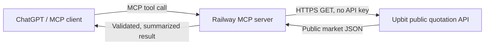

# Upbit Market Analyzer

업비트 **공개 시세 데이터만 조회**하는 읽기 전용 MCP 서버입니다. ChatGPT/Codex 같은 MCP 클라이언트가 원화 마켓의 현재가, 캔들, 호가와 단순 기술 요약을 조회할 수 있습니다.

> 이 프로젝트는 주문, 잔액, 입출금, 계정 조회를 구현하지 않으며 업비트 Access Key/Secret Key를 요구하지 않습니다. 결과는 투자 조언이나 수익 보장이 아닙니다.

## 제공 도구

| MCP 도구 | 기능 |
|---|---|
| `list_krw_markets` | KRW 마켓 목록 |
| `get_ticker` | 현재가·변동률·거래대금 |
| `get_orderbook` | 최우선 호가와 호가 잔량 |
| `get_candles` | 분/일봉 OHLCV |
| `analyze_market` | 이동평균·RSI·변동성·거래량 기반의 객관적 요약 |
| `get_monitor_status` | WebSocket 연결·수신·재접속 상태 |
| `get_recent_alerts` | 최근 탐지 신호 목록 |
| `get_candidate_performance` | 목표1·손절 선도달 적중률과 MFE·MAE 기록 |

## 실시간 감시

`ENABLE_MARKET_MONITOR=true`이면 서버 시작과 함께 업비트 공개 WebSocket
`wss://api.upbit.com/websocket/v1`의 체결 스트림을 계속 수신합니다. 기본값은 모든
KRW 마켓이며 다음 조건을 탐지합니다.

- 1분 가격과 거래대금 동시 급증
- 직전 5분 고점을 거래대금 증가와 함께 돌파
- 30분 이상 좁은 횡보 후 상단을 거래대금 급증과 함께 재돌파
- 거래대금을 동반한 1분 급락 위험

연결이 끊기면 1~60초 지수 백오프로 자동 재연결합니다. 같은 종목·같은 신호는
기본 10분 동안 다시 알리지 않으며, 전체 알림은 분당 5건으로 제한합니다.

장시간 횡보 재돌파는 기본적으로 직전 30분 가격폭이 3% 이내이고, 최근 1분
가격이 횡보 상단보다 0.3% 이상 높으며, 최근 1분 거래대금이 횡보 구간의 분당
평균보다 3배 이상일 때 탐지합니다. 이 신호는 짧은 급등 신호보다 먼저 후보
분석에 전달됩니다. 후보 분석은 다음 완료 1분봉 마감까지 기다린 뒤 진행됩니다.

Telegram을 사용하려면 `TELEGRAM_BOT_TOKEN`과 `TELEGRAM_CHAT_ID`를 Railway
환경변수에만 등록합니다. 두 값이 없을 때도 탐지는 계속되며 Railway 로그와
`get_recent_alerts`에서 확인할 수 있습니다. 이 감시기는 자동 주문을 하지 않습니다.

일반 `[업비트 실시간 감시]` 관찰 메시지를 Telegram에서 숨기고 확인을 통과한
`[조건부 진입 후보]`만 받으려면 `TELEGRAM_SEND_OBSERVATION_ALERTS=false`,
`TELEGRAM_SEND_CANDIDATE_ALERTS=true`로 설정합니다. 일반 메시지를 숨겨도 내부 감시,
로그 기록과 조건부 후보 분석은 계속됩니다. `ENABLE_CANDIDATE_ANALYSIS=true`도 유지해야
후보 메시지가 생성됩니다.

조건부 후보 중 가까운 구조적 저항까지 실제 상승 여유가 일정 기준 이상인 메시지만
받으려면 `TELEGRAM_CANDIDATE_MIN_RESISTANCE_ROOM_PCT`를 사용합니다. 예를 들어 `5`로
설정하면 저항 여유가 5% 이상인 후보만 Telegram에 전송됩니다. 이전 변수인
`TELEGRAM_CANDIDATE_MIN_TARGET_1_PCT`는 새 변수가 없을 때의 호환용 기본값으로만
사용합니다. 임의로 계산된 목표수익률 자체는 더 이상 전송 기준이 아닙니다.

점수 기준도 함께 적용하려면 `TELEGRAM_CANDIDATE_MIN_SCORE`를 사용합니다. 예를 들어
`90`으로 설정하면 점수 90점 이상이면서 위 목표 상승폭 기준까지 충족한 후보만
Telegram에 전송됩니다.

### 조건부 진입 후보 분석

`ENABLE_CANDIDATE_ANALYSIS=true`이면 상승 신호 뒤 다음 1분봉이 완성될 때까지 기다린 후
현재가·1분·5분·15분봉·BTC 흐름과 2초 간격의 공개 호가 3회를 조회합니다. 진행 중인
봉은 모든 MA·RSI·거래량 계산에서 제외합니다. 완료 1분봉이 돌파선 위에서 마감하고,
거래량이 이전 20봉 평균과 직전 봉 대비 유지되며, 종가 위치·윗꼬리·스프레드·BTC 환경,
가까운 저항까지의 여유와 손익비를 모두 통과한 경우에만 후보를 생성합니다.

점수는 중복된 단기 상승 조건을 계속 더하지 않고 돌파 확인 25점, 완료봉 거래량 20점,
1·5·15분 추세 20점, BTC 환경 15점, 저항 여유·손익비 10점, 호가 지속·유동성 10점의
독립 영역으로 구성합니다. 100점은 수익 확률이 아니라 모든 품질 영역을 충족했다는
뜻입니다. 목표가는 고정 7%·10%가 아니라 최근 5분·15분 스윙 고점과 당일 고가에서
찾은 실제 구조적 저항을 사용합니다.

내부 후보 생성과 Telegram 전송의 기본 조건점수는 모두 90점으로 맞춰, 전송되지 않은
80점대 후보가 승인 후보처럼 처리되어 재관찰 목록에서 빠지는 일을 방지합니다.

후보 발생 뒤 가격이 추격금지선 위나 진입구간 아래로 벗어났다가 30분 안에 진입구간을
다시 회복하면 완료봉 조건을 다시 검증해 `[조건부 진입 후보 | 재지지]`로 한 번 더
알릴 수 있습니다. 손절선을 이탈하면 해당 후보 생명주기는 즉시 종료됩니다.

최초 심층검증에서 탈락한 종목도 기본 12시간 동안 내부 관찰 목록에 유지합니다.
그 기간에 30분 이상 좁은 횡보 뒤 거래량을 동반해 상단을 재돌파하면 기존 후보
쿨다운과 무관하게 다시 완료봉·호가·저항·손익비를 검증합니다. BTC 약세와 당일
상승률 과다는 단독 자동 탈락 사유로 사용하지 않고 조건점수 감점 및 추천 비중
축소로 반영합니다. 거래량 소멸, 긴 윗꼬리, 추격 구간, 가까운 저항과 불리한
손익비 같은 직접적인 진입 위험은 계속 하드 필터로 유지합니다.

후보가 생성되면 이후 공개 체결가를 추적해 30분 안에 1차 목표와 손절 중 어느 쪽에
먼저 도달했는지 기록합니다. `get_candidate_performance`에서 결정 표본 수, 1차 목표
선도달률, 만료 수, 후보별 최대 유리 변동(MFE)과 최대 불리 변동(MAE)을 조회할 수
있습니다. 이 수치는 서버 재시작 전 메모리 표본을 기준으로 하며 수익 보장이 아닙니다.

전송 여부와 별개로 심층검증에 들어간 모든 원시 상승 신호도 12시간 동안 추적합니다.
기본적으로 신호가 대비 +5%와 -3% 중 어느 가격에 먼저 도달했는지 기록하며,
`get_candidate_performance`의 `raw_signal_performance`에서 탈락 후보까지 포함한
발굴 성능을 확인할 수 있습니다. Telegram의 `점수` 표기는 확률로 오해되지 않도록
`조건점수`로 표시합니다.

가격은 현재 공개 호가 간격에서 호가 단위를 추론해 표시합니다. 분석은 공개 데이터의
규칙 기반 선별이며 자동 주문, 개인 계좌 접근, 수익 보장을 하지 않습니다. 같은 종목은
기본 15분 동안 다시 후보 분석하지 않고, 최근 10분 이내 급락 신호가 있었던 종목은
후보에서 제외합니다.

## 요청 흐름



MCP 엔드포인트는 배포 주소의 `/mcp`입니다. 서버 자체는 거래소 계정에 로그인하지 않습니다.

## 인증과 비밀정보

- 업비트 개인 API 키: 사용하지 않음
- JWT/주문 서명: 생성하지 않음
- 주문·잔액·입출금 API: 코드에서 차단
- GitHub/Railway 토큰: 각 서비스의 연결 계층에서 관리하며 저장소에 저장하지 않음
- 로그: 환경변수 값, 인증 헤더 또는 비밀정보를 기록하지 않음
- Telegram Bot Token: 선택 사항이며 Railway 환경변수에서만 읽음

자세한 내용은 [SECURITY.md](SECURITY.md)와 [docs/AUTHENTICATION.md](docs/AUTHENTICATION.md)를 참고하세요.

## 로컬 실행

Python 3.11 이상이 필요합니다.

```bash
python -m venv .venv
source .venv/bin/activate
pip install -r requirements.txt
python server.py
```

MCP 클라이언트에서 `http://localhost:8000/mcp`에 연결합니다.

## Railway 배포

1. Railway에서 이 GitHub 저장소를 선택합니다.
2. 별도의 업비트 키는 등록하지 않습니다.
3. Railway가 `railway.json`의 시작 명령을 사용합니다.
4. 생성된 공개 도메인의 끝에 `/mcp`를 붙여 ChatGPT MCP 연결 주소로 사용합니다.

Railway가 제공하는 `PORT` 환경변수는 시작 명령에서 자동 사용됩니다.

## 안전 경계

`upbit_client.py`는 허용된 공개 호스트와 `/v1/market/all`, `/v1/ticker`, `/v1/orderbook`, `/v1/candles/*` 경로만 호출합니다. 사용자 입력을 URL로 직접 사용하지 않습니다.

## 공식 참고 문서

- [Upbit API Reference](https://global-docs.upbit.com/reference)
- [MCP Python SDK](https://github.com/modelcontextprotocol/python-sdk)
